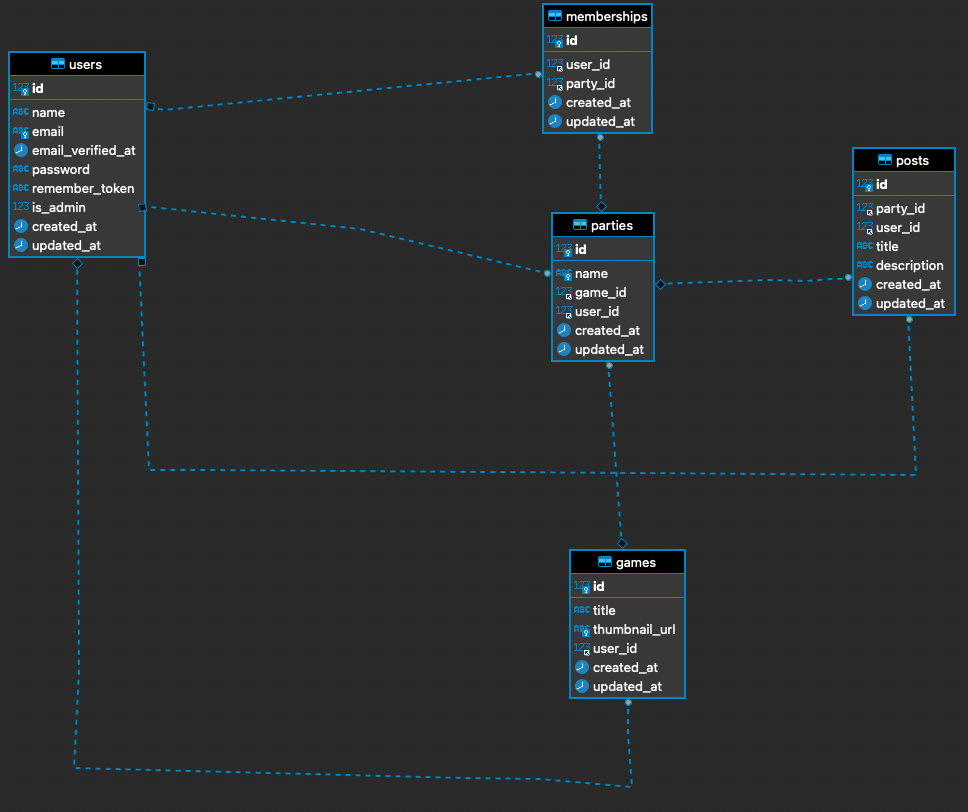
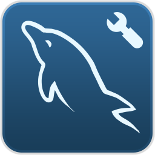

<h1 align="center">
   API REST
</h1>

# Tiempo de desarrollo 👨🏽‍💻
| Inicio 12-7-21 | Fin 19-7-21 |
| -------------  | ----------  |

## Introducción

Desde producción nos piden desarrollar una <b>API REST</b> completa para impulsar la manera que tienen los trabajadores de relacionarse, desde el cambio a trabajar de manera remota. La aplicación permitirá a los trabajadores seguir interactuando con los compañeros de trabajo de manera remota.

## Funciones

- [Registro de usuario, línea 11 a 28](app/Http/Controllers/PassportAuthController.php).
- [Login de usuario, línea 32 a 46](app/Http/Controllers/PassportAuthController.php).
- [Entrar a una fiesta, línea 46 a 79](app/Http/Controllers/MembershipController.php).
- [Enviar un mensaje en una fiesta, línea 40 a 74](app/Http/Controllers/MembershipController.php).
- [Crear un juego, línea 49 a 75](app/Http/Controllers/GameController.php).
- [Listar los juego, línea 94 a 110](app/Http/Controllers/GameController.php).
- [Buscar un juego por título, línea 26 a 40](app/Http/Controllers/GameController.php).

##Imágenes

# 
Tecnologías 💻

##### Para el desarrollo de este proyecto he trabajado con las siguientes tecnologías. 

 <a href="https://git-scm.com/" target="_blank">  <a href="https://nodejs.org" target="_blank">  </a>  </a>

## Proyects
- <a href="https://github.com/2020-JAUG">This is a link to my repositories</a>

- [UP](#up)

 